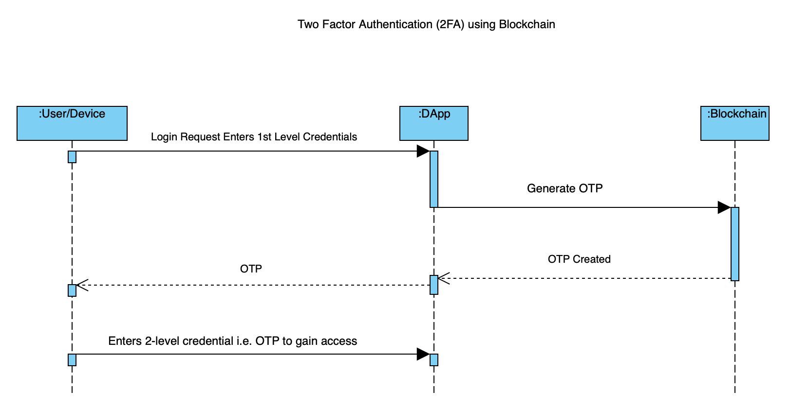

# Lab - 2

- Mohammad Jamshed Qureshi
- GBC Student: 101260567
- Program: T175 Blockchain Development Fall 2019)

This is an individual in-class Lab exercise.

You need to :

 - Come up with an idea of creating decentralized application (If you already have idea for capstone project, use that)

 -  Go to this link and elaborate the user journey using sequence diagram.

 - Take the screen shot of the sequence diagram

 - Give a one-liner description of your DAPP and attach it's sequence diagram's screen shot to complete the submission

---

# Lab Work: User Journey using Sequence Diagram

## Description

Its a 2-factor authentication service based on Blockchain. In the below scenario: A user/device enter their 1st level credentials to enter a website/service. The app server contacts the blockchain to generate a one-time password and sends it back to the user/device. User/Device uses this 2nd level credential to access the needed resource.

## Actors

- User
- DApp
- Ethereum Blockchain Smart Contract

## Actions

- User Login Request

